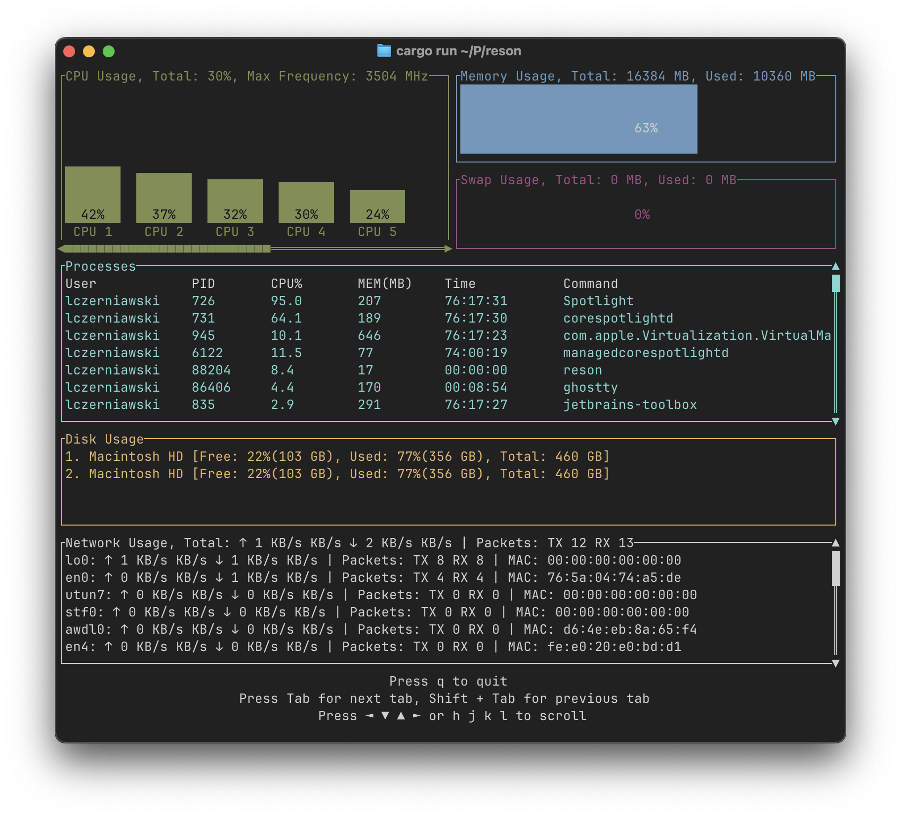

# Reson System Monitor

Reson is a terminal-based system monitor written in Rust.
The idea behind the project is to provide an efficient and insightful monitoring tool for your system's resources, that is easy to use and understand.
It uses a text-based UI to display various system statistics such as CPU usage, memory usage, running processes, disk usage, and network activity.
The application leverages asynchronous tasks (via Tokio) to simultaneously handle user input, refresh the system data, and update the UI.

## Why "Reson"?

The name "Reson" is derived from combining the words "resource" and "monitor."

## Features

- **CPU Usage Dashboard:** Displays a bar chart for per-CPU usage with horizontal scrolling.
- **Memory Gauges:** Shows memory (RAM) and swap usage with gauges.
- **Processes Table:** Lists running processes, sorted by a combined CPU and memory score. Supports vertical scrolling.
- **Disk Usage:** Displays disk usage details and sorts disks by usage. Supports vertical scrolling.
- **Network Widget:** Displays network throughput and packet counts along with other network details. Supports vertical scrolling.
- **Keyboard Navigation:**
  • Use arrow keys (or h/j/k/l) to scroll the active widget.
  • Press Tab/Shift+Tab to switch between tabs (CPU, Processes, Disks, Networks).
  • Press `q` or `Esc` (or Ctrl+c) to quit the application.
- **Responsive Layout:** Automatic layout update based on terminal size.

## To Do
- [ ] Add multiple filter support

## Installation
TODO

## Usage

Run the application:
   cargo run --release

Once running, you can use the following keys:
- Use ←/→ or h/l to scroll horizontally (CPU tab).
- Use ↑/↓ or j/k to scroll vertically (Processes, Disks, Networks).
- Press Tab or Shift+Tab to change the active tab.
- Press `q` (or Esc) to quit.

## Contributing

Contributions, issues, and feature requests are welcome!
Feel free to check the [issues page](https://github.com/yourusername/reson/issues) if you want to contribute.

## License

Distributed under the MIT License. See [LICENSE](LICENSE) for more information.
